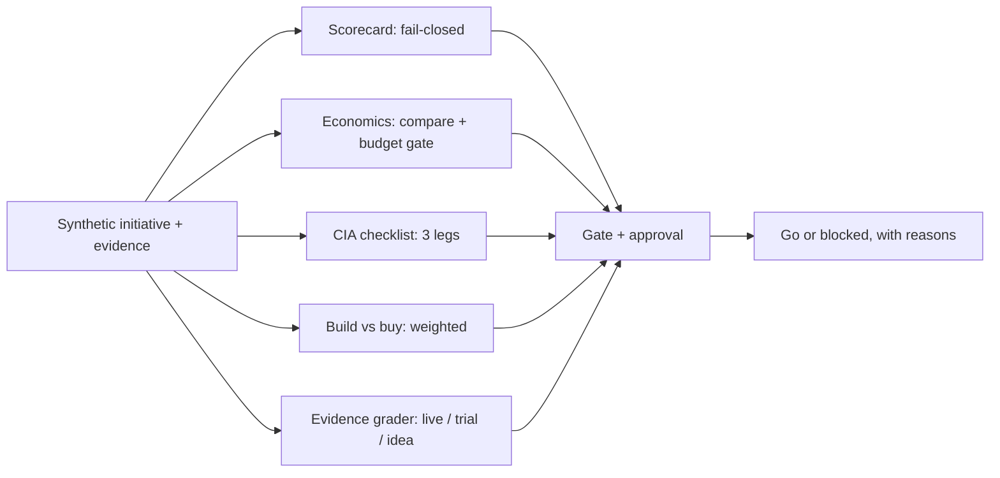

# Knowledge — architecture (Mermaid)

```mermaid
flowchart LR
    Input[Synthetic initiative + evidence] --> Score[Scorecard: fail-closed]
    Input --> Price[Economics: compare + budget gate]
    Input --> Sec[CIA checklist: 3 legs]
    Input --> Choice[Build vs buy: weighted]
    Input --> Grade[Evidence grader: live / trial / idea]
    Score --> Decision[Gate + approval]
    Price --> Decision
    Sec --> Decision
    Choice --> Decision
    Grade --> Decision
    Decision --> Out[Go or blocked, with reasons]
```

See `docs/architecture.md` for the module-level diagram.
